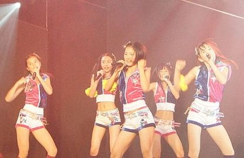
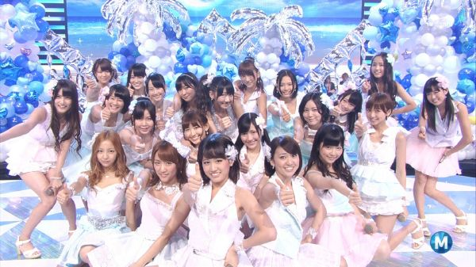
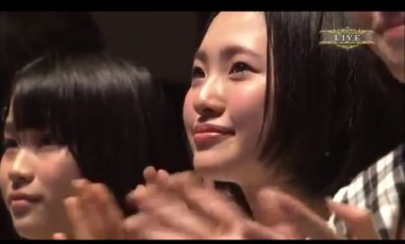
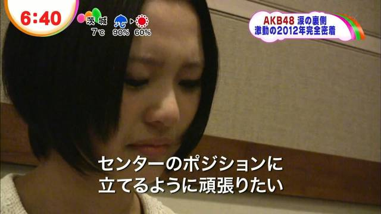

#「哈鲁P」的偶像历程
第一章：哈鲁P的故事

## 偶像「哈鲁P（はるっぴ）」的诞生

AKB48的姐妹团「HKT48」诞生了！
这则新闻对当时还是初中生的兒玉遥内心产生了波动。兒玉遥虽然并不饭偶像。作为同时活跃于篮球部和学生会活动中，又爱表现自己的她来说，让她倾心的人是AKB48的前田敦子。另外，在看了NMB48诞生时偶像渡辺美優紀成为明星的故事，于是兒玉遥内心萌生了要成为和她们一样的想法。

于是兒玉遥参加了HKT48一期生甄选，要通过高倍率的甄选对于没有舞蹈经验的兒玉遥来说并不是一件容易的事。
所幸最终还是顺利通过了。紧接着HKT48的一期生们便开始投身于每日的训练之中，由于没有舞蹈经验，她总是留下训练到很晚。

此时「哈鲁P」还没有诞生。兒玉遥最初的昵称是「harurun（はるるん）」出处是初代支配人的成员介绍：

```
这个孩子很有礼貌又很可靠。
无论谁的意见或是建议都会认真倾听，并详细地笔记。
不过，她也有些粗心。
好不容易写好笔记，却忘记带回家这种事也是有的。
还有，诸如认真填完问卷却忘记把问卷交回。
常能看见她一边小声嘟囔着 “啊咧！？东西放哪儿了呢？” 一边四下翻找。
不知为何村重总是粘着她。
相对于礼貌、努力、且可靠的兒玉。性格完全不同的村重为什么会如此中意兒玉呢。
常常听到“我(村重)能在哈伦伦边上就好了” “哈伦伦，你要去哪儿” 之类的话。
心地善良的哈伦伦总是能欣然地接受村重。
```

终于到了2011年11月26日，HKT48初次的公演「手牵手(手をつなぎながら)」揭开了帷幕，站在Center位上的是兒玉遥。并且，公布的昵称是「哈鲁P(はるっぴ)」至此，终于，偶像
「哈鲁P」诞生了。




## Center「哈鲁P」

为什么兒玉遥会被选为Center呢，「Bubuka(ブブカ)」2012年11月号上，刊登了佐藤支配人的如下评述：

```
- 让人在意的还是Center的人选呢。最终拍板的是秋元桑，而推荐人应该是您吧？

佐藤： 是的。这是听取了大家(舞蹈老师、舞台监督、经纪人等)的意见后的决定。除了兒玉以外，没有更合适的人选。兒玉是她们中最努力的孩子，她在学校是篮球部的成员，所以有不服输的特质，但同时又能保持着谦虚的姿态。对于Center来说 若不能被所有人喜欢那是不行的，在成员中，最受欢迎的也是兒玉。尽管在能力上有着诸多不足，但是年纪还很小，AKB当初不也是从零开始发展的嘛。赌上HKT48的未来，果敢地选择了兒玉。
```

于是兒玉遥成为了Center。自然的，作为Center以HKT48之颜的的身份参与活动是必须的。次年2月发售的AKB48单曲「GIVE ME FIVE!」的C/W曲中和松井珠理奈、島崎遥香一同以新世代的代表的身份一同、第一次参加了单曲的收录。作为HKT48的代表，兒玉遥的名字自此渐渐被人熟知。

然而，HKT48中有魅力的成员还有很多。刚开始时，网络上传出了「凭什么兒玉遥能成为Center？」的声音。其他成员的饭发起了猛烈的抨击。最初的兒玉遥并没能很好地将自己的魅力传达出来。

直到实际看过公演之后，也就是从2012年春季开始，对兒玉遥评价产生改观的饭开始增多起来。
没人再能否认在剧场中兒玉遥身为Center的存在感、作为偶像的气场成为了令大家都认可的东西。难以想象迄今为止哈鲁P到底做出了何种程度的努力。就此真正意义上的偶像哈鲁P诞生了。

## 初次的选拔以及总选举

随后兒玉遥进入了AKB48单曲「仲夏的Sounds Good（真夏のSounds Good）」的选拔，但是在摄影后兒玉遥流露出非常懊悔的情绪。
```
2012/5/26のGoogle+ 兒玉遥の投稿より

「仲夏的Sounds Good」

大家看过PV了吗?
这是仅从HKT48中挑选一人 
向世人介绍HKT48的大好机会

所以我决定 
要用最好的表现去面对

但是现场试镜的是完全陌生的地方
以及不认识的选拔成员们和工作人员

顿时感到困惑 焦虑 和不安

之后的舞蹈当中
完全跟不上节奏
大脑中也一片空白

再次确认了PV之后
发现自己完全不像是在跳舞
觉得自己愧对那些支持HKT48以及整个48G的人

我没有做好自己该做的
因为我并没有与之相称的能力
现在只是感到后悔

所以
我想以此作为动力
尽我所能地认真对待接下来的每一场公演

希望能够过多或少对48G的新历史做出一些贡献

有点突然 抱歉
这些话无论如何都像传达给你们

谢谢你能读完
```

在「仲夏的Sounds Good」这张单曲的PV中，尤其是在舞蹈版的PV中，可以感觉到兒玉遥的动作比别人慢一拍，这是因为她还没有完全记住舞蹈动作的状况下，就开始了PV的拍摄。 因此网上出现了对她批评的声音，紧接着在剧场出道之后，她也因为没有舞蹈经验，学得很慢。而在这期间，AKB过密的行程也是她没法好好记住舞蹈的原因，这段时间对兒玉遥来说可谓相当地严峻。

但是在电视上的音乐番组披露时，兒玉遥已经摆脱了这种状态，并展现了完美的舞姿。她的魅力就算是隔着电视也能充分地传达给观众。



「仲夏的Sounds Good」是2012年总选选票单，此届总选举也是HKT48初次参加的总选举，作为Center的兒玉遥被寄予入围的厚望，然而，最终结果却是圈外。 HKT48中唯一入围的成员只有宮脇咲良一人。



**※听了樱花的发言、在鼓掌的兒玉遥**


## 指原莉乃的移籍以及5名成员的退出

总选举结束后的6月开始，HKT48发生了很多事。最开始的事件起因于6月15日的深夜广播番组ANN。那件如今已被大众广为知悉的事件，指原莉乃的移籍决定。

从那天夜里直到第二天早上，网上出现了洪水般的评论。大多数内容是HKT48的饭对于指原莉乃移籍过来所要造成的影响感到不安。一方面，左迁已经造成了不良观感，另一方面，由于这次移籍 会否导致有成员被移出TeamH，又或者，指原会否空降Center。至今为止虽然只有一点点，但大家一起建立起来的东西就这样会失去而感到不安。

次日一早，这种不安不仅在饭中，乃至在成员中也愈发明显。越来越多的成员怀着对未来的迷茫和不安，在G+上表达了自己的心情。其中，兒玉遥关于此事的投稿，第一篇的标题是 “吓到了”

```
兒玉遥 6/16 7:56

写给大家
虽然还不是太明白
还是想要传达大家
我最喜欢HKT48了
也很喜欢大家
今后也会一直喜欢下去
和大家一起
加油吧
```


读了哈鲁P的投稿，陷入不安的饭们喜极而泣。
之后，随着指原莉乃的移籍公演的举行，饭们的不安也逐渐消除了。由于是17人的队伍，每首歌由不同的成员轮流出演，其他方面则与通常的公演保持一致。Center依然是哈鲁P。

在这之后，指原以HKT48的宣传塔的身份投身于宣传活动中。随后，认可指原的饭渐渐多了起来，正当人们觉得HKT48会有大发展的时候，发生了这么一件事。

8月，突然发生了HKT48中5名成员的退出，却没有给出理由，以讹传讹，终于引发了各家媒体的报道。关于这件事，哈鲁P在G+上记下了如下的文字。

```
兒玉遥 8/18 14:55

5名成员的辞退 
说实话 
将会对HKT48造成很大的影响

和我一样 
从初期就开始共同努力的5人 
和他们的共同记忆对我来说是非常重要的

虽然为此有许多事需要考虑 
但是HKT48才刚刚开始

我们不能就此不前

从现在起 
我们HKT48的大家会一起更尽力地去追寻梦想

我们会加油的

各位
HKT48今后的应援
也请多多关照
```

HKT48迎来了困难的时期。因为成员太少，凑不齐公演所需的16人时，因此出现过13人公演的情况。
在网络上偶尔还能看到「HKT48已经完蛋了」这种说法。在这种状况下，还有更大的打击在等着哈鲁P。

## 生诞祭的眼泪

AKB48が次に発売した2012年10月のシングル「UZA」の選抜にHKT48から選ばれたのは兒玉遥ではなく総選挙にランクインした宮脇咲良でした。これは他グループも総選挙の結果を反映した選抜を行っていたため、ある意味必然だったかもしれません。しかし、はるっぴにはとても悔しいものでした。

AKB48之后的的单曲「UZA」于2012年10月发售。HKT48的选拔成员不是兒玉遥而是总选入围了的宮脇咲良。和其他团一样，这是是根据总选结果决定的选拔，有这样的结果是必然的。但是，哈鲁P却相当地懊悔。

在「AKB猜拳大会（AKBじゃんけん大会）」上披露了UZA选拔的初次演出。这一天正是兒玉遥生日9月19日。第二天就是在HKT48剧场举行的兒玉遥生诞祭。那是兒玉遥第一次在舞台上落泪，并说出了如下这段话。

```
作为15岁的我，能够一直以来站在Center的位置上，总是在思考「为什么选中了我？」不擅长跳舞，和其他成员相比也不够可爱。总是因没有过人之处的我被选为Center而困惑和烦恼着。多亏大家的鼓励才能让我坚持到现在。


15岁的我得到了很多上媒体的机会，得到了C/W曲的选拔机会。还得到了『仲夏的Sounds Good!』的选拔机会。但是没有达到期望的结果，没能在总选举上留名，这是留有遗憾的一年。昨天发表的28单没能进入选拔非常地后悔，被大家热烈地应援着、期待着，对于什么都做不好的自己非常懊悔，再这样维持现状下去是不行的。一直以来我都是以自己的步伐努力着，继续这样下去会追不上大家，也无法超越任何人。在16岁，能够得到这2分半的如此美妙的视频，有大家为我举办的这么完美的生诞祭，真的感到很开心。我会把大家的这份期待深藏心底 希望今后能有更大的飞跃。
```

这件事给了饭们很大的打击。从来都是把Happy挂在嘴上的哈鲁P一直以来却是在苦恼之中。大多数饭因此也受到了冲击，决定加倍努力应援的饭也有所增加。然而 这还不是最让兒玉遥苦恼的事。

## 不再是Center的兒玉遥

2012年9月30日，HKT48终于迎来了2期生。从此HKT48得以有了正向的发展，成员人数不足的问题得以解决。二期生担起了剧场演出的任务，给了一期生在各种媒体上出演 提供了更多的可能性。随着「HaKaTa百貨店」在关东地区的开播，成员们可以被深入了解的时机终于到来了。

此时，尚未出道的HKT48有了一次发表原创歌曲的机会。AKB48的单曲「永远的压力(永遠プレッシャー)」中每个团都将会有一首歌作为C/W曲发布。HKT48的歌曲是「初恋蝴蝶(初恋バタフライ)」。

11月15日的公演中披露了「初恋蝴蝶」的MV。期盼已久的原创曲。但是Center却不是兒玉遥，而是身为2期生的田島芽瑠。 在甄选时秋元康将田島芽瑠评价为可以和松井珠理奈相提并论的人才。尽管有过Center将会由田島芽瑠担当的推测，没想到这样的推测成了现实，饭们因此再次受到了打击。得知结果的兒玉遥此时又经受着何等程度的打击呢。

那天晚上 兒玉遥发布了如下的文章。

```
兒玉遥 11/15 23:19 +1090 500 件

今天第一次公开了在AKB48桑的
29th单曲的Typec里收录的C/W
也是HKT48第一首的原创歌曲

我们也是第一次看到
成员一个一个的都很耀眼
觉得是首很不错的MV!!

希望也能快点
让大家看到(๑ت๑)

我个人的感想…
我不管到哪里都是『兒玉遥』
还有很多不足的地方
我希望能「不管到哪里我都能发光」

老实说,心中有许多的想法
但是,我不会去在意的

时间是不会等人的

我是真心的喜欢HKT48
更加更加
想要成为最强的团队
想变的有名
想要飞跃……

『想在明年的CD出道时有所成果』
这样的心情是不会输给任何人的
从今以后也要保持自信
以我自己的步调前进!!

请多多指教m(__)m
```

失去C位后鼓足勇气去克服的哈鲁P，写下这段文字的时候，距离MV的拍摄已经经过了一段的时间。这使得她能够摆脱这种痛苦，然而在摄影后的影像中，还是记录下了这样的画面。



这是2013年2月公开的电影「Documentary of AKB48」的宣传片段，含泪说着为了重返Center而去努力。但是这段内容，并没有被收录于纪录片的正片中。

## HKT48的出道

HKT48的出道定于2013年，于是有了很多媒体披露的机会。报道的重心则是在兒玉遥身上，作为中心成员的兒玉遥自2012起至2013年间，接连出演了日本唱片大赏(日本レコード大賞) 红白歌合战等番组。在这期间，哈鲁P做出了一个重大的决断，那就是对外表现出自己的弱势。从未示弱过的哈鲁P于12月28日记下了如下的文字。

```
我讨厌自己。
自己没有自信。

对这样的自己更加讨厌了。

在舞台上闪耀的人
不管在哪里都能
闪闪发光。

这样的光辉应该是与生俱来的才能。
但是，不能疏忽大意
因为努力了
因为有自信
才能闪闪发光吧。

中学参加课外活动的时候
『不管多优秀的才能都胜不过努力。』学到了这样的格言。

我虽然没有什么才能，
但我能够靠努力。
成为努力的天才就行了。

我也想在那个舞台歌唱。
跳舞。
将许多Happy传送给大家。
前辈们闪耀的舞台上我也想要闪闪发光。

现在，我能做的事
现在，加倍的努力。

现在，只有现在。
为了不让自己后悔，努力增强自信。

这样，一定能闪闪发光。

哟西！
绝对要登上那个舞台！
拜托大家。
请跟随我吧！

也许有时会遇到挫折。
但我并不喜欢示弱。

虽然到现在为止一直都隐藏着，
我还有为我应援的大家在。

所以，想要告诉大家。
包括我的弱点在内
也都能为我应援。

因为这样相信着。
大舌头也包括呢(๑ت๑)

```

最后，HKT48的出道终于定在了2013年3月20日。不过Center并不是兒玉遥而是田島芽瑠。关于这一变动
兒玉遥在当天的SNS上没有留下任何信息，出道披露后的握手会上，似乎从各种不同的人那里收集到了各种不同的看法。终于，3月25日哈鲁P写下了如下的文字。

```
兒玉遥 3/25 23:32

晚上好。是兒玉遥＼(^o^)／

我现在，并不是HKT48的Center了。

出道之前，
还站在那里的，为什么呢？这样想着。

也有流下过眼泪。

不管怎么说
对不能够做好
Center工作的自己
是感到最不甘心的。

对成员和为我应援的朋友们也
感到十分的抱歉。

但是，现在已经吹散了心中的乌云。
心情也已经整理好了。

大家我不要紧的!!
请不要为担心我。

因为站在芽瑠的身后
才发觉的事情，见到的风景
真是有许多。

芽瑠也，像那时候的我一样
不对，是比我还背负了更多的东西，
我做为前辈想要好好支持她
芽瑠自身也做为HKT48出道单曲的脸面
希望能好好的加油。

握手会和这个G+里
「在我的心中，哈鲁P才是Center哦！」
听到了许多大家的这种话语
很高兴心中热热的。

我应该是要将
笑脸和元气传达给大家的
相反的却从大家那里得到了许多。

最喜欢这样的大家了。

真的一直以来十分感谢。
感谢大家。

我不管走到哪里都是兒玉遥。

现在位置有闪闪发光吗？

虽然自己也不太清楚，
现在要在这个位置上好好的去享受
能够爬升到什么位置
也有这样想尝试的心情。

博多的传说，
才刚刚开始。

今后，我要
和大家一起去制造。

我，是不会输的！

现在开始的传说
请跟随着我来吧。

虽然是这样的我
请多多关照。

晚安。
噗咻~~~哈~~~(•ө•)♡
```

尽管这段文字写得坚定而果敢，不过之后对此也有过「仿佛置身于黑洞一般」的表述。出道曲没有获得Center位对她来说打击是非常巨大的。相关的内容在「哈鲁P」的偶像历程的第二章有详细的记述。

## 兼任 AKB48 TeamA

2013年4月，AKB48各个的分团在武道馆举行了单独演唱会。HKT48在如此盛大的舞台上举行了的初次的演唱会。在这里兒玉遥和渡辺麻友的Unit演出了「遗憾少女（残念少女）」这首歌。整场的演唱会中兒玉遥的演出在整个HKT48中受到了极大的好评。然而，由于是如此的大型的场合，往常是兒玉遥担当的开场的MC部分，这次委托给了指原。兒玉遥只是介绍了「喜欢！喜欢！小跳步！（スキ・スキ・スキップ）」的歌名，在中间的MC部分她也没有再担当过MC的成员。

4月28日，48G一起的演出中她和其他成员8人一同表演了「制服真碍事（制服が邪魔をする）」尽管也受到了好评，不过与田島芽瑠、朝長美桜能够和渡辺麻友、松井珠理奈4人Unit表演「叹息的人偶（嘆きのフィギュア）」相比，受到的待遇可以说是较低的。

从武道馆公演中受到的待遇来看，可以说兒玉遥没有受到重视。不过，最后发表的惊喜却震惊了所有人。 在「AKB48Group春之人事变动（AKB48グループ春の人事異動）」至今为止所有兼任的姐妹团成员全部解除。新的兼任成员发表中，HKT只有一个人，兒玉遥兼任到了AKB48 TeamA。哈鲁P在发表这个决定的时候，只是一味的在哭泣。


一开始被叫到名字时，以为自己要被移籍走一时不知所措。当得知兼任可以继续留在HKT48活动时才渐渐安心，随后在舞台上展露出了笑容。当天晚上，她在G+上留下了如下的文字。

```
 兒玉遥 4/28 21:27

我，HKT48 TeamH 儿玉遥
兼任 AKB48 TeamA 了。

虽然，脑袋里还是混乱一片
但还是要向前看
要从前辈那里吸收更多东西。

会努力的!!
```

之后第二天，HKT48在福冈举行了第一次的全国握手会。兒玉遥所在的那一列排起了长龙，大多都是想要传达兼任相关内容的饭。那天晚上兒玉遥在g+上写下了如下的文字。

```
兒玉遥 4/29 23:00

握手会上
恭喜兼任TeamA！
加油哦！
得到了好多的声援。

这些事真是感到高兴
另一面
稍微有点寂寞啊。
好像会离的很远。
也听到了这样的声音。

我是，不希望大家这样去想的。

兼任这件事
对 HKT48 TeamH 来说也是
对 AKB48 TeamA 来说也是
都会有活动的。

所以，
不管哪边都不想要
不上不下的去做事。

虽然是非常难的一件事
也许在跨越这个难关后会有什么在等着我吧。

对福冈的朋友也是
对远方的朋友也是为了能够见到大家
会努力的(ง •̀_•́)ง

另外，还要注意身体的健康…

我，中学的时候
得到过全勤奖的
应该没关系
自说自话这样去想的( ˙³˙)笑

应该会变的更忙了
会更加当心的。

十分感谢!!
```

兒玉遥积极地面对了TeamA的兼任，并将其作为HKT48外的新的挑战。兼任是机会，焦虑也随之而来。

```
兒玉遥 5/7 0:35

一有空余时间多出来
我就马上会想着兼任的事。

是能和憧憬着的前辈一起进行活动的机会
很开心、想着绝对要抓住这个机会
自己的干劲不断的涌出来
另一方面、也有自己能不能跟得上大家？没问题吗？这样的焦虑
也会感觉到不安

各种各样的心情
互相交错在一起也是必然的

不论在什么时候什么地方
有着必须跨过去的障碍也是必然的
我想就这样继续加油下去

加油吧！
```

## 2013年总选举

之后，又到了AKB48总选举的季节了。2013年开始实行了立候补制(需要成员事先申请才能参加总选)。HKT48全员都申请参加，自然的兒玉遥也申请参加了总选。

5月22日，速报发表，兒玉遥获得的24位的好成绩。在HKT48团内仅次于指原莉乃，由于这样的高顺位所有人都大吃一惊。兒玉遥曾被认为是HKT48中的不人气成员 而事实却让这种说法不攻自破。当晚兒玉遥写下了如下的文字。

```
兒玉遥 5/22 21:02

吓吓吓一大跳。

速度24位十分感谢!!
充满了感谢之情。

已经止不住眼泪了。
但是，会努力忍住的!!
```

6月8日总选正式开始，饭们以进入UG选拔(32位以内)，以HKT48团内第二为目标而参战总选。结果却是37位，在HKT48团内的顺位被宮脇咲良超过，屈居第3 最终仅仅达到了预期的最低目标 (进入NG)。这种程度的结果无法称之为胜利，不过兒玉遥的总选感言却可圈可点。


```

我是HKT48 TeamH、AKB48 TeamA兼任的哈鲁P
为我应援的各位 为我投票的各位 
真的非常感谢

去年总选圈外 相当悔恨 
总选入围是我的目标之一 
现在 能够站在这里 
非常地开心

37位这个成绩 
凝结了大家的期待的感情 
值得自豪的名次 
谢谢大家

但是 我不会满足于自己当前的表现 
无论是唱歌还是跳舞还都不擅长 
所以如果不能够提升自己的实力那样是不行的 
并且 为了让HKT48有更大的飞跃 
为了达成作为兒玉遥的自己的目标 
我需要把目标定得更高才行

所以 我决定了 
今年开始 将会把去年篠田桑(篠田麻里子)的发言铭记于心 
怀着击溃前辈的心情而努力 
真心非常感谢
```

最后口齿含混地说出「怀着击溃前辈的心情」的兒玉遥，她的总选感言，就算看完全场之后仍旧能够让人记忆犹新。

那天晚上，哈鲁P写了篇很长很长的文章。

```
兒玉遥
一般公開で共有しました - 0:29

晚上好。
HKT48 TeamH、AKB48 TeamA的
昵称哈鲁P的儿玉遥＼(^o^)／

这一次，
让我入围了
Next Girls第37位
真的十分感谢！

正因为有去年的经历
才会有现在的自己。

去年宫脇咲良酱获得了47位
那时候HKT48只有一个人入围。

同队的成员能够入围
当然会觉的高兴
相对的也非常不甘心。

并不是对排名而是自己。

那时开始，产生了对手的意识
在公演等等的舞台上，
要怎么做才能吸引大家的视线
怎样的表演才能感动到大家。
在G+和握手会上
要怎么做才能让大家高兴
能让大家产生想要再见面的感觉，
以自己的方式去思考
度过了一年的时间。

思考着这些的过程中
慢慢的，感觉找到了
自己的风格。

我最初是没有任何经验
而进入HKT48的
能胜过其她成员的地方
基本上，没有。

但是，只有这个
能有胜过别人的自信。

就算不拿手
用哈鲁P的风格全力去做。

对大家来说
这份全力有没有传达到呢？

这次的第37位这个排名
让我注意到了许多事情。

和我一起追逐梦想的朋友
能有这么多。
真的要感谢。

还有，这个排名和其她人比起来
虽然还是，有不甘心的心情的，
和去年的自己比起来，
从圈外到37位。
确实感受到了向上攀升的感觉
第一次尝到了数字上的成就感。

重要的是，要超越自己。
比起昨天的自己今天的自己是有所成长的。

所以，一生的对手就是自己。

就和我在选举时说的一样
从大家那里得到的排名
感到很满足的，也很骄傲。

但是，
对现在的自己还很不满足。

为了让HKT48更加更加有知名度，
为了实现自己的多栖艺人的梦想，
还有，为了终有一天能进入16位的选拔
保持现在的我是不行的。

今年篠田桑的话语回响在胸中
『要去击贵前辈们！』
正式场合，大舌头了真是好后悔
今年真的要以这种心情
去前进的!!

Mio，妹鲁，爱酱，樱花
和撒西的第一位
HKT48成员的大跃进
只会感到高兴。

TeamA的兼任也
当是一个机会去努力。

篠田桑的毕业老实说，感到很伤心。
还想要，今后看着她的背影前进的。
还期着能一起进行活动的。

但是，并不是，今天就是最后了
能在一起活动的机会应该不会太少
那时希望能制造一些美好的回忆＼(^o^)／

今天，真的十分感谢!!

今后也，虽然是这样的我
请和我一起追逐梦想吧。

今天的心情是，哈鲁鲁P♪

晚安。
噗咻~~~哈~~~╰(°ㅂ°)╯

```

